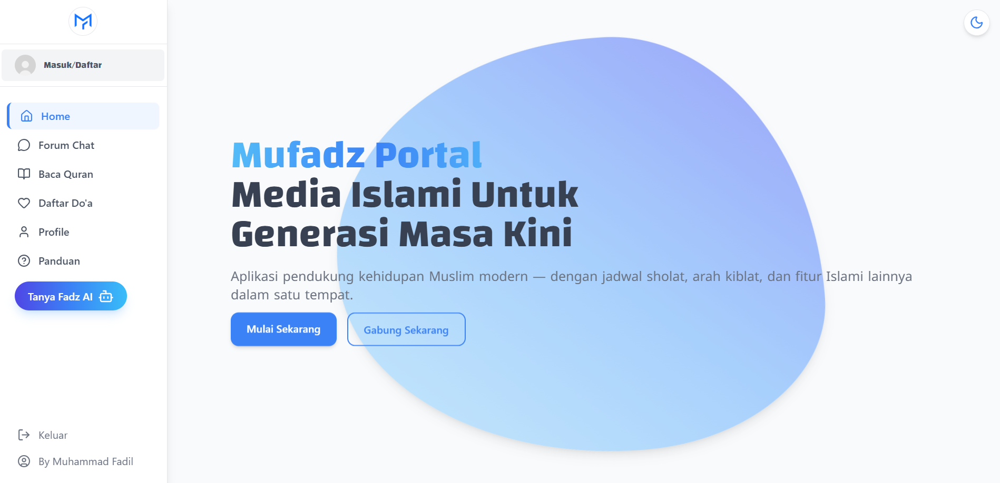
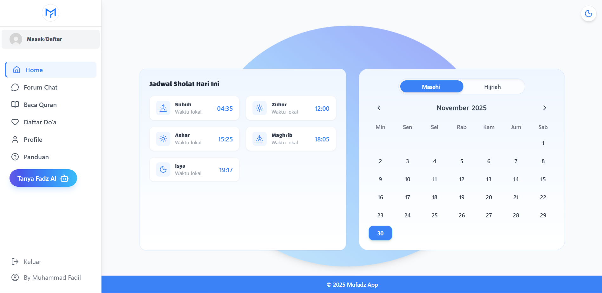
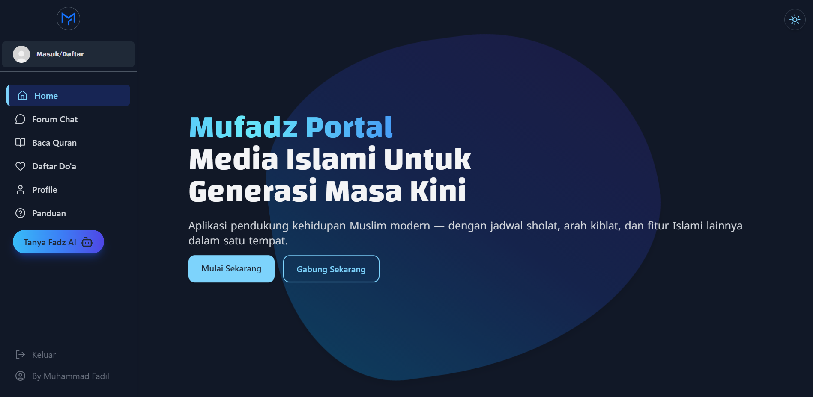
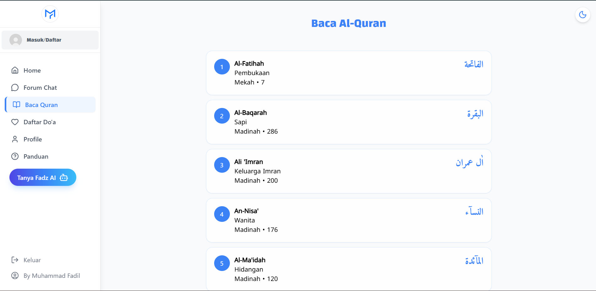
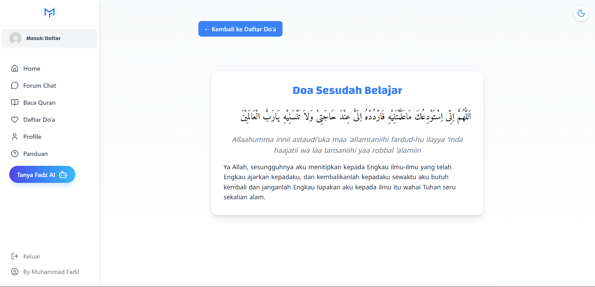
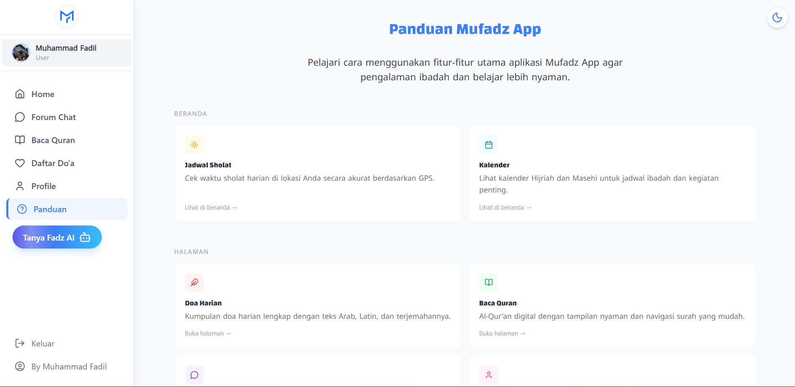

  

# 🌙 Mufadz Portal — Muslim Daily App

**Mufadz Portal** adalah aplikasi Islami modern berbasis **MERN Stack (MySql)**, dibangun sebagai proyek jangka panjang untuk melatih skill **Fullstack Web Development** sambil menciptakan aplikasi yang bermanfaat.

Aplikasi ini terus dikembangkan secara bertahap: dimulai dari fitur dasar seperti **Jadwal Sholat, Kalender, Qur'an, Doa-doa**, hingga fitur lanjutan seperti **Login, Chat, dan Reminder**.

---

# 🚀 Tech Stack
- **React + TypeScript + Vite**
- **TailwindCSS**
- **Express.js, MySql** 

---

# 🎯 Tujuan Proyek
Membangun aplikasi Islami modern dengan fitur-fitur yang relevan untuk kehidupan sehari-hari:

- 🕌 Jadwal Sholat (lokasi pengguna)
- 📅 Kalender Hijriyah & Masehi
- 📖 Baca Al-Qur'an
- 🤲 Doa Harian
- 🌗 Mode Gelap & Terang
- 🔔 (Rencana) Reminder & Notifikasi
- 💬 (Rencana) Chat Realtime
- 👤 (Rencana) Sistem User / Login
- ⚡ Dan fitur lainnya

---

# 📱 Preview Aplikasi

---

## 🏠 Home Page (Light Mode)

## 🌙 Home Page (Dark Mode)

---

# 📖 Fitur Qur'an

### 📚 List Surah

### 📜 Detail Surah & Ayat

---

# 🤲 Fitur Doa Harian

### 🕌 List Doa

### 📘 Detail Doa

---

# 📘 Panduan Aplikasi

---

